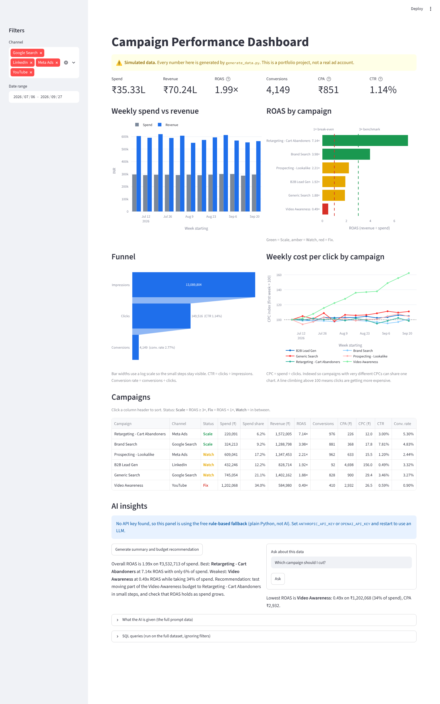

# Campaign Performance Dashboard (simulated data)

A small marketing analytics project: generate ad campaign data, analyse it with SQL, show it in a Streamlit dashboard, and use an LLM to write plain-language insights.

> **The data is simulated.** Every number comes from `generate_data.py`. It is not from a real ad account, client or employer. The "findings" below exist because I built them into the generator on purpose, so the analysis has something to find.



*Screenshot taken with no API key set, so the AI panel shows the rule-based fallback, not LLM output.*

## What it does

- **Data:** 12 weeks of daily rows for 6 campaigns on 4 channels (Google Search, Meta Ads, YouTube, LinkedIn). 504 rows, amounts in INR.
- **SQL:** loads the CSV into SQLite and runs 7 analysis queries.
- **Dashboard:** channel and date filters, KPI cards, weekly spend vs revenue, ROAS by campaign with 1× and 3× lines, a funnel, a CPC trend, and a sortable campaign table with Scale / Watch / Fix status.
- **AI panel:** one button writes a summary and budget recommendation for the filtered data. A question box answers questions using only the data it is given.

## How to run

```bash
pip install -r requirements.txt
python generate_data.py      # writes data/campaigns.csv (same output every time, seed = 42)
python sql_analysis.py       # builds data/marketing.db and prints every query result
streamlit run app.py
```

### AI panel (optional API key)

The key is read from an environment variable and is never stored in the code.

```bash
export ANTHROPIC_API_KEY="sk-ant-..."   # uses Claude
# or
export OPENAI_API_KEY="sk-..."          # uses OpenAI
```

On Windows PowerShell use `$env:ANTHROPIC_API_KEY="..."`.

Both APIs are paid (a few rupees is plenty for this project). **Without a key the app still works:** the panel falls back to simple Python rules that pick the best and worst campaign by ROAS. That fallback is not AI and the dashboard says so.

## Files

| File | Job |
|---|---|
| `generate_data.py` | Creates the simulated CSV. Campaign settings at the top control the story. |
| `sql_analysis.py` | Cleans the CSV with pandas, loads it into SQLite, holds the SQL queries. |
| `metrics.py` | All metric formulas and the Scale / Watch / Fix rule. |
| `ai_insights.py` | Builds the text summary sent to the LLM, calls Claude or OpenAI, and holds the fallback. |
| `app.py` | The Streamlit dashboard. |

## Metrics

| Metric | Formula | What it tells you |
|---|---|---|
| CTR (click-through rate) | clicks ÷ impressions | Is the ad getting clicked? |
| CPC (cost per click) | spend ÷ clicks | What one visit costs |
| Conversion rate | conversions ÷ clicks | Do visitors go on to buy or sign up? |
| CPA (cost per acquisition) | spend ÷ conversions | What one conversion costs |
| ROAS (return on ad spend) | revenue ÷ spend | Rupees back per rupee spent. 1× is break-even on ad spend. |
| Funnel | impressions → clicks → conversions | Where people drop off |

Status rule: **Scale** if ROAS ≥ 3×, **Fix** if ROAS < 1×, **Watch** in between. The 3× line is a common rule of thumb, not a universal target. The right number depends on profit margin.

Ratios are always calculated from summed totals (total revenue ÷ total spend), not by averaging daily ratios.

## What the simulated data shows

These patterns were designed into the generator:

| Campaign | Spend share | ROAS | Status |
|---|---|---|---|
| Retargeting - Cart Abandoners (Meta) | 6% | 7.14× | Scale |
| Brand Search (Google) | 9% | 3.98× | Scale |
| Prospecting - Lookalike (Meta) | 17% | 2.21× | Watch |
| B2B Lead Gen (LinkedIn) | 12% | 1.92× | Watch |
| Generic Search (Google) | 21% | 1.88× | Watch |
| Video Awareness (YouTube) | 34% | 0.49× | Fix |

- **Retargeting** has the best return on the smallest budget.
- **Video Awareness** takes about a third of spend, returns less than it costs, and its CPC rises from about ₹21 to ₹34 over the 12 weeks.
- **Weekends:** LinkedIn spend and ROAS drop (B2B audience), Meta and YouTube rise.

A caveat I would raise in a real account: retargeting audiences are small, so its ROAS would not hold if the budget were multiplied. And an awareness campaign is not normally judged on direct ROAS alone.

## SQL queries

All queries live in `sql_analysis.py` and run against one table, `campaigns`.

### 1. ROAS and CPA by campaign

Which campaigns earn back their spend, and what one conversion costs in each.

```sql
SELECT campaign,
       channel,
       ROUND(SUM(spend))                                  AS spend,
       ROUND(SUM(revenue))                                AS revenue,
       ROUND(SUM(revenue) / NULLIF(SUM(spend), 0), 2)     AS roas,
       ROUND(SUM(spend) / NULLIF(SUM(conversions), 0))    AS cpa
FROM campaigns
GROUP BY campaign, channel
ORDER BY roas DESC;
```

### 2. Weekly trend

Is overall performance improving or slipping week to week?

```sql
SELECT week_start,
       ROUND(SUM(spend))                              AS spend,
       ROUND(SUM(revenue))                            AS revenue,
       SUM(conversions)                               AS conversions,
       ROUND(SUM(revenue) / NULLIF(SUM(spend), 0), 2) AS roas
FROM campaigns
GROUP BY week_start
ORDER BY week_start;
```

### 3. Channel share of spend

Where the money goes versus where the revenue comes from. A channel with a much bigger spend share than revenue share is a red flag.

```sql
SELECT channel,
       ROUND(SUM(spend))                                                  AS spend,
       ROUND(100.0 * SUM(spend) / (SELECT SUM(spend) FROM campaigns), 1)  AS spend_share_pct,
       ROUND(100.0 * SUM(revenue) / (SELECT SUM(revenue) FROM campaigns), 1) AS revenue_share_pct
FROM campaigns
GROUP BY channel
ORDER BY spend DESC;
```

### 4. Week-over-week change

`LAG()` is a window function that looks at the previous row, here the previous week, to get the percentage change.

```sql
WITH weekly AS (
    SELECT week_start,
           SUM(spend)   AS spend,
           SUM(revenue) AS revenue
    FROM campaigns
    GROUP BY week_start
)
SELECT week_start,
       ROUND(spend)   AS spend,
       ROUND(revenue) AS revenue,
       ROUND(100.0 * (spend - LAG(spend) OVER (ORDER BY week_start))
             / LAG(spend) OVER (ORDER BY week_start), 1)     AS spend_wow_pct,
       ROUND(100.0 * (revenue - LAG(revenue) OVER (ORDER BY week_start))
             / LAG(revenue) OVER (ORDER BY week_start), 1)   AS revenue_wow_pct
FROM weekly
ORDER BY week_start;
```

### 5. Worst campaigns by cost per conversion

Highest cost per conversion. Shown next to revenue per conversion, because a high CPA is fine if each conversion is worth a lot (LinkedIn) and bad if it is not (YouTube).

```sql
SELECT campaign,
       SUM(conversions)                                 AS conversions,
       ROUND(SUM(spend) / NULLIF(SUM(conversions), 0))  AS cpa,
       ROUND(SUM(revenue) / NULLIF(SUM(conversions), 0)) AS revenue_per_conversion,
       ROUND(SUM(spend) / NULLIF(SUM(clicks), 0), 2)    AS cpc
FROM campaigns
GROUP BY campaign
ORDER BY cpa DESC
LIMIT 3;
```

### 6. Funnel rates by channel

Where each channel loses people: at the click (low CTR) or after the click (low conversion rate).

```sql
SELECT channel,
       SUM(impressions)                                               AS impressions,
       SUM(clicks)                                                    AS clicks,
       SUM(conversions)                                               AS conversions,
       ROUND(100.0 * SUM(clicks) / NULLIF(SUM(impressions), 0), 2)    AS ctr_pct,
       ROUND(100.0 * SUM(conversions) / NULLIF(SUM(clicks), 0), 2)    AS conversion_rate_pct
FROM campaigns
GROUP BY channel
ORDER BY conversion_rate_pct DESC;
```

### 7. Weekday vs weekend by channel

Weekend effects. `strftime('%w')` returns the day of week, where 0 is Sunday and 6 is Saturday.

```sql
SELECT channel,
       CASE WHEN strftime('%w', date) IN ('0', '6') THEN 'Weekend' ELSE 'Weekday' END AS day_type,
       ROUND(SUM(spend) / COUNT(DISTINCT date))        AS avg_daily_spend,
       ROUND(SUM(revenue) / NULLIF(SUM(spend), 0), 2)  AS roas
FROM campaigns
GROUP BY channel, day_type
ORDER BY channel, day_type;
```

## How the AI part works

1. `build_context()` turns the filtered data into a short text table (campaign metrics, weekly totals, weekday vs weekend).
2. That text is sent to the LLM with a system prompt that says: use only these numbers, say so if the data cannot answer, and the data is simulated.
3. The dashboard has an expander showing exactly what text the model receives.

Limits: the prompt reduces made-up answers but cannot guarantee none, so the numbers in an AI answer should be checked against the table. The model sees aggregated summaries, not the daily rows.

## What I learned

*(Draft. Rewrite this in your own words before publishing.)*

- Why ratios must be computed from totals, not averaged.
- A high CPA is not automatically bad: LinkedIn has the highest CPA but each conversion is worth far more than YouTube's.
- Spend share versus revenue share is a quick way to spot a budget problem.
- Giving an LLM a small, pre-computed table and strict instructions works better than asking it to do the maths.
- SQL window functions (`LAG`) for week-over-week change.

## How this was built

Built as a portfolio project with help from an AI coding assistant (Claude). I can explain every file. There is no real client, account or campaign behind it.
